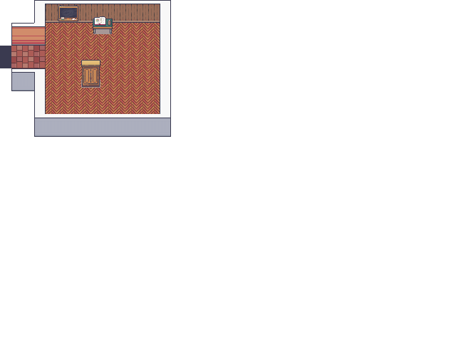
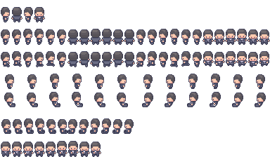
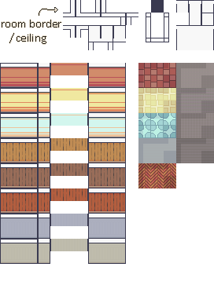
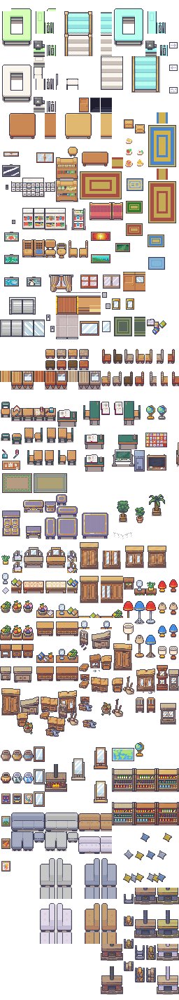

# 2D Portfolio

Table of Content

* [How to edit maps files and spritesheet](#how-to-edit-maps-files-and-spritesheet)
* [Assets](#assets)
   * [Map](#map)
   * [Sprites](#sprites)
* [Languages](#this-repo-is-developed-with)

   
How to

   
   * [How to run](#how-to-run)
   * [How to build](#how-to-build)
   * [How to preview the build](#how-to-preview-the-build)
   * [How to host](#how-to-host)
   
   

   
   * [Useful links](#useful-links)

## How to edit maps files and spritesheet
>[!NOTE]
>In order to edit maps you need to download this program: [**Tiled Editor**](https://www.mapeditor.org/)

1. New Map
   - Tile size / 16x16px
   - Map size / Fixed / 27x20 tiles
2. Edit / Preferences / Theme
   - Use custom interface font / 12px(or your choose)
3. View / Snapping / No Snapping
4. New Tileset
   - Boundaries
   - Props
   - Ground

When the TileSet Map is ready, Export as an image / Only visible layers.

### Assets
#### Map

#### Sprites
<table>
   <tr>
      <th colspan=2>

[**Modern Interiors**](https://limezu.itch.io/moderninteriors)
      </th>
   <tr>
      <th>Character</th>
      <td> 
   

      </td>
   </tr>
   <tr>
      <th>Interior</th>
      <td> 
   

      </td>
   </tr>
   <tr>
      <th>Interior</th>
      <td> 
   

      </td>
   </tr>
</table>

 

#### This repo is developed with 
  
 
 

 
___
## How to run

Note: You need `Node.js` and `npm` installed on your machine.

`npm install` then `npm run dev`

## How to build

`npm run build` and a dist folder should be created.

## How to preview the build

`npm run preview`

## How to host

Once the project is built. Take the content of the dist folder and drag and drop it
to your favorite static site hosting provider.
___

- This repository is developed based on [**JSLegendDev Portfolio**](https://github.com/JSLegendDev/2d-portfolio-kaboom)
  - His tutorial on how to build this on [YouTube](https://www.youtube.com/watch?v=gwtfWORCN0U)

---

#### Useful links

- [_Github Writing_](https://docs.github.com/en/get-started/writing-on-github/getting-started-with-writing-and-formatting-on-github/basic-writing-and-formatting-syntax)
